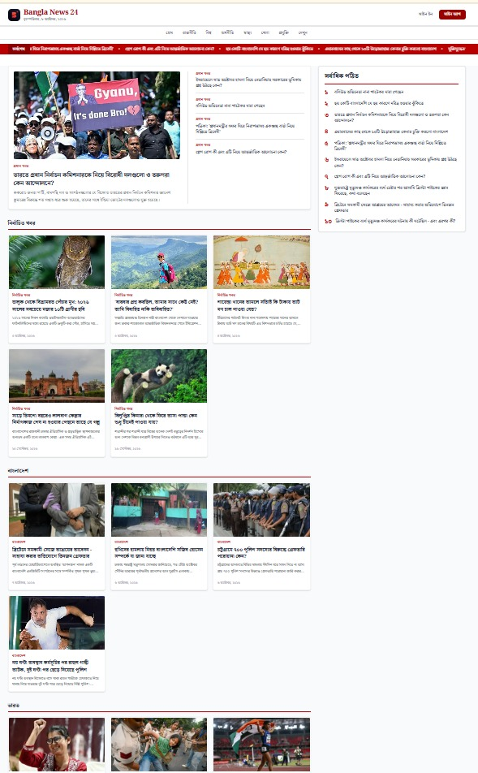
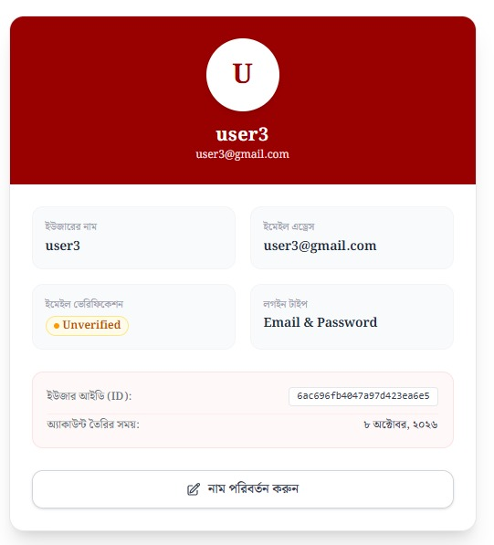
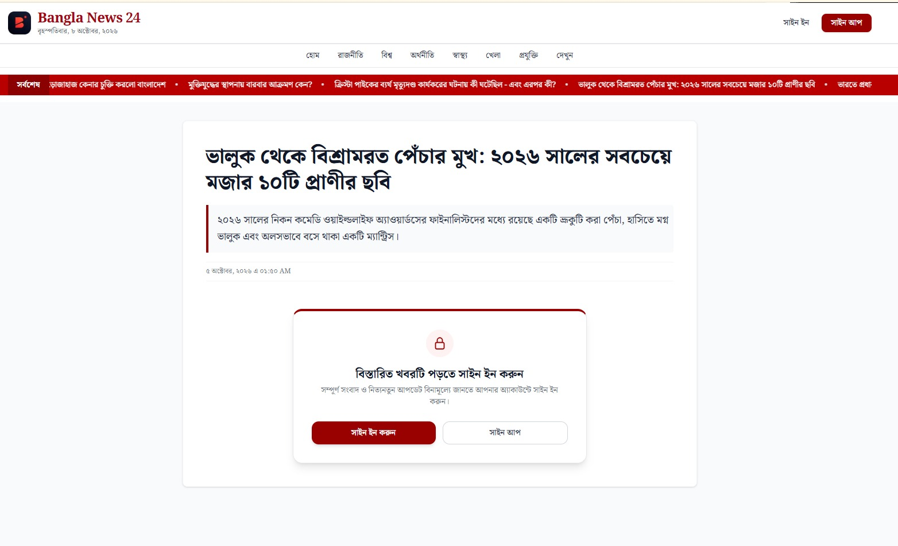
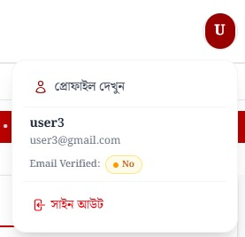

# Bangla News 24

A modern, full-stack Bengali news portal built with Next.js, TypeScript, Tailwind CSS, DaisyUI, Better Auth, and MongoDB. The application provides category-based news browsing, detailed news pages, social authentication, protected content, and dynamic user profile management through a responsive interface.

**Live Demo:** [Bangla News 24](https://bangla-news-24-navy.vercel.app/)


### 📸 Application Screenshots

| Homepage & News Headlines | User Profile UI |
| :---: | :---: |
|  |  |

| Detailed News View | Sign In & Social Auth |
| :---: | :---: |
|  |  |

## 📑 Table of Contents

- [Overview](#-overview)
- [Features](#-features)
- [Technology Stack](#️-technology-stack)
- [Project Structure](#-project-structure)
- [Getting Started](#-getting-started)
- [Environment Variables](#-environment-variables)
- [Authentication Setup](#-authentication-setup)
- [Deployment](#-deployment)
- [Security Considerations](#-security-considerations)
- [Future Improvements](#-future-improvements)
- [License](#-license)
- [Contact](#-contact)

## 📖 Overview

Bangla News 24 is a responsive Bengali news platform designed to make news discovery and reading simple and accessible. Users can explore news by category, view headlines through a scrolling news ticker, and access detailed articles through a dedicated news interface.

The platform integrates Better Auth for account management, Google and GitHub OAuth for social sign-in, and MongoDB for persistent data storage. Authenticated users can access protected news content and manage their profile information.

## ✨ Features

### 🔐 Authentication and Account Management

- Email and password registration and sign-in.
- Google and GitHub OAuth authentication.
- Session-aware user interface.
- User dropdown with avatar and email verification status.
- Sign-out functionality.
- Protected user profile page.
- Inline profile information updates.

### 📰 News Browsing and Navigation

- Category-based news pages using dynamic routes.
- Dedicated pages for individual news articles.
- Interactive scrolling headline marquee.
- Organized news grids and responsive navigation.
- Loading interface for improved navigation feedback.
- Custom 404 page for invalid or unavailable news articles.

### 🛡️ Protected Content

- Route protection through custom proxy logic.
- News previews for unauthenticated visitors.
- Sign-in call to action for restricted content.
- Full article content available to authenticated users, according to the application's access rules.

### 🎨 User Experience

- Responsive layouts for desktop, tablet, and mobile.
- Deep red brand identity using `#990000`.
- Toast notifications with `react-hot-toast`.
- Consistent navigation and interactive UI components.
- Custom loading and error states.

## 🛠️ Technology Stack

| Technology | Purpose |
|---|---|
| Next.js App Router | Application framework and routing |
| TypeScript | Static typing and maintainable code |
| React | Component-based user interfaces |
| Tailwind CSS | Utility-first styling |
| DaisyUI | UI components and styling utilities |
| Better Auth | Authentication and session management |
| MongoDB Atlas | Cloud database |
| react-hot-toast | Toast notifications |
| Vercel | Application deployment |

## 📁 Project Structure

```text
bangla-news-24/
├── public/
│   ├── logo.webp
│   ├── image-01.jpeg
│   ├── image-02.jpeg
│   ├── image-03.jpeg
│   ├── image-04.jpeg
│   └── image-05.jpeg
├── src/
│   ├── app/
│   │   ├── (auth)/
│   │   │   ├── signin/
│   │   │   └── signup/
│   │   ├── api/
│   │   ├── category/
│   │   │   └── [category]/
│   │   ├── detailed-news/
│   │   │   └── [newsId]/
│   │   ├── profile/
│   │   ├── globals.css
│   │   ├── layout.tsx
│   │   ├── loading.tsx
│   │   ├── not-found.tsx
│   │   └── page.tsx
│   ├── components/
│   │   ├── MainSections/
│   │   ├── NavLinks/
│   │   ├── Footer.tsx
│   │   ├── Marquee.tsx
│   │   ├── Navbar.tsx
│   │   └── UserInfo.tsx
│   ├── lib/
│   └── proxy.ts
├── .gitignore
├── package.json
├── tsconfig.json
└── README.md
```

*Note: This structure highlights the main application files. Your actual repository may contain additional files and directories.*

## 🚀 Getting Started

Follow these steps to run the project locally.

### Prerequisites

Make sure you have the following installed:

- Node.js compatible with your project's Next.js version.
- npm, yarn, pnpm, or another supported package manager.
- A MongoDB Atlas cluster or compatible MongoDB database.
- Google and GitHub OAuth credentials for social authentication.

### 1. Clone the Repository

Replace `YOUR_USERNAME` with your GitHub username.

```bash
git clone https://github.com/YOUR_USERNAME/bangla-news-24.git
cd bangla-news-24
```

### 2. Install Dependencies

```bash
npm install
```

### 3. Configure Environment Variables

Create a `.env.local` file in the project root and add the following variables:

```env
# Application URLs
BETTER_AUTH_SECRET=replace_with_a_secure_random_secret
BETTER_AUTH_URL=http://localhost:3000
NEXT_PUBLIC_APP_URL=http://localhost:3000

# MongoDB
MONGODB_URL=mongodb+srv://<username>:<password>@<cluster-host>/bangla_news?retryWrites=true&w=majority

# Google OAuth
GOOGLE_CLIENT_ID=your_google_client_id
GOOGLE_CLIENT_SECRET=your_google_client_secret

# GitHub OAuth
GITHUB_CLIENT_ID=your_github_client_id
GITHUB_CLIENT_SECRET=your_github_client_secret
```

**Important:** Ensure the environment variable names match those used in your application configuration. Generate a secure authentication secret and never commit real credentials to GitHub.

### 4. Configure MongoDB Atlas

1. Create a MongoDB Atlas cluster.
2. Create a database user with an appropriate password.
3. Configure network access for your development environment.
4. Add your MongoDB connection string to `.env.local`.
5. Ensure the database user has only the permissions required by the application.

### 5. Configure OAuth Providers

#### Google OAuth

1. Visit the [Google Cloud Console](https://console.cloud.google.com/).
2. Create or select a project.
3. Configure the OAuth consent screen.
4. Create an OAuth client for a web application.
5. Configure the authorized origins and callback URL.

#### GitHub OAuth

1. Visit [GitHub Developer Settings](https://github.com/settings/developers).
2. Register or select an OAuth application.
3. Configure the application URL and authorization callback URL.

Typical local callback URLs are:

```text
http://localhost:3000/api/auth/callback/google
http://localhost:3000/api/auth/callback/github
```

Verify these callback paths against your Better Auth configuration before using them.

### 6. Start the Development Server

```bash
npm run dev
```

Open [http://localhost:3000](http://localhost:3000) in your browser.

## 🌐 Deployment

The application can be deployed using [Vercel](https://vercel.com/).

### Deployment Steps

1. Push the project to GitHub.
2. Import the repository into Vercel.
3. Configure all required environment variables in the Vercel project settings.
4. Update the application and authentication URLs to your production domain.
5. Configure the production OAuth callback URLs in Google Cloud Console and GitHub Developer Settings.
6. Verify MongoDB connectivity and network access.
7. Deploy the application and test the authentication, news browsing, and profile workflows.

### Production Environment Variables

For the production deployment, update the application URLs:

```env
BETTER_AUTH_URL=https://your-domain.com
NEXT_PUBLIC_APP_URL=https://your-domain.com
```

Replace `your-domain.com` with your actual deployment domain.

## 🔒 Security Considerations

- Never commit `.env.local` or files containing sensitive credentials.
- Keep authentication secrets, OAuth client secrets, and database credentials private.
- Configure OAuth callback URLs for the appropriate environment.
- Restrict MongoDB network access and database permissions wherever practical.
- Enforce authorization on the server for protected news content and profile operations.
- Do not rely solely on client-side or proxy-based route protection to secure sensitive data.
- Validate profile updates and verify permissions before saving changes.
- Ensure protected API routes and server-side data requests validate the user's session and authorization.

## 🔮 Future Improvements

Potential enhancements for future versions include:

- News search with keyword filtering.
- Pagination or infinite scrolling.
- Bookmarks and saved articles.
- Personalized news recommendations.
- An editorial dashboard for news management.
- Improved accessibility and keyboard navigation.
- Automated testing and continuous integration.
- Search engine optimization with structured data.
- More comprehensive loading, empty, and error states.

## 📄 License

This project is available under the MIT License, provided that an MIT `LICENSE` file is included in the repository. See the [LICENSE](LICENSE) file for details.

## 📬 Contact

**Nader Ar Rahman**  
Web Developer | Library & Information Science Student

- **LinkedIn:** [linkedin.com/in/naderarrahman](https://www.linkedin.com/in/naderarrahman/)
- **Email:** [nader2418@student.nstu.edu.bd](mailto:nader2418@student.nstu.edu.bd)
- **GitHub:** [github.com/naderarrahman](https://github.com/naderarrahman)

---

<p align="center">
  Developed with ❤️ by <a href="https://www.linkedin.com/in/naderarrahman/"><strong>Nader Ar Rahman</strong></a>
</p>